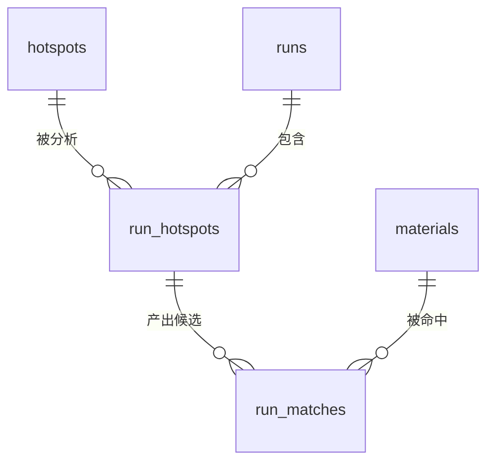

# 数据契约

> 本文档是**数据库结构与数据字典的唯一事实源**。代码（SQLAlchemy 模型、Alembic 迁移）向本契约对齐。
> 相关文档：API 契约见 `openapi.yaml`，检索算法参数见 `检索契约.md`，环境变量见 `配置契约.md`。

## 一、范围与原则

- 四类业务实体落库，共 **5 张表**：`materials`、`hotspots`、`runs`、`run_hotspots`、`run_matches`。
- 命名一律 snake_case；主键统一 `uuid`（默认 `gen_random_uuid()`）；时间戳统一 `timestamptz`（UTC）。
- **一次运行（run）覆盖一次提交的全部热点**，与 `docs/产品方案.md` §8.1"机会总览（一张表列出每个热点）"的口径一致。因此比初版计划的四张表多一张 `run_hotspots`，用来承载"批次 × 热点"的结果。
- 素材不做物理删除的业务语义；`data/materials/` 是唯一素材来源，库里是索引副本，素材文件消失时对应行由重新索引清理。

## 二、ER 图

关系说明：一次提交产生 1 条 `runs`；批次内每个热点产生 1 条 `run_hotspots`；每个热点选出若干候选，落到 `run_matches`；`materials` 是素材索引，可被多次命中。

## 三、表结构

### 3.1 `materials` — 素材索引

| 字段 | 类型 | 可空 | 默认 | 说明 |
| --- | --- | --- | --- | --- |
| `id` | uuid | 否 | `gen_random_uuid()` | 主键 |
| `path` | text | 否 | — | 素材绝对路径，唯一 |
| `type` | text | 否 | `'video'` | `video` / `image` |
| `title` | text | 否 | `''` | 标题，来自旁车文件或模型打标 |
| `description` | text | 否 | `''` | 一句话描述 |
| `tags` | text[] | 否 | `'{}'` | 标签 |
| `elements` | jsonb | 否 | `'[]'` | 爆点要素数组，结构同 API 的 `Element` |
| `source` | text | 否 | `'filename'` | 打标来源：`sidecar` / `vision` / `filename` / `legacy` |
| `duration_s` | numeric(8,2) | 否 | `0` | 时长（视频），图片为 0 |
| `width` | integer | 否 | `0` | 宽 |
| `height` | integer | 否 | `0` | 高 |
| `has_audio` | boolean | 否 | `false` | 是否含音轨 |
| `size_bytes` | bigint | 否 | `0` | 文件大小 |
| `mtime` | timestamptz | 是 | — | 文件修改时间 |
| `keyframes` | jsonb | 否 | `'[]'` | 关键帧相对路径数组 |
| `fingerprint` | text | 是 | — | `mtime` + `size_bytes` 拼接，增量索引判断依据 |
| `embedding` | vector(1024) | 是 | — | 语义向量；未打标时为 NULL |
| `embedding_model` | text | 是 | — | 生成该向量的模型名，用于识别"换模型需重建" |
| `indexed_at` | timestamptz | 否 | `now()` | 本次索引时间 |

### 3.2 `hotspots` — 热点与线索

| 字段 | 类型 | 可空 | 默认 | 说明 |
| --- | --- | --- | --- | --- |
| `id` | uuid | 否 | `gen_random_uuid()` | 主键 |
| `raw_text` | text | 否 | — | 热点原文（用户输入，不做改写） |
| `clue` | jsonb | 否 | — | 线索快照，结构同 API 的 `HotspotClue` |
| `created_at` | timestamptz | 否 | `now()` | 首次分析时间 |

说明：`hotspots` 按原文去重复用——同一句热点再次提交时复用已有线索，避免重复付费（对应 `docs/产品方案.md` P1"历史运行回看"）。

### 3.3 `runs` — 一次运行的批次信息

| 字段 | 类型 | 可空 | 默认 | 说明 |
| --- | --- | --- | --- | --- |
| `id` | uuid | 否 | `gen_random_uuid()` | 主键，即 API 的 `run_id` |
| `job_id` | text | 否 | — | 异步任务标识，唯一；API 的 `job_id` |
| `status` | text | 否 | `'queued'` | `queued` / `running` / `succeeded` / `failed` |
| `topk` | integer | 否 | `5` | 本批次检索的截断上限（1–20），来自 `POST /api/analyze` 的 `topk` |
| `request_id` | text | 是 | — | 提交请求的 `X-Request-ID`，便于按请求排障（S3.3 起写入） |
| `created_at` | timestamptz | 否 | `now()` | 入队时间 |
| `started_at` | timestamptz | 是 | — | 开始执行时间 |
| `finished_at` | timestamptz | 是 | — | 结束时间 |
| `llm_calls` | integer | 否 | `0` | 批次内模型调用次数 |
| `prompt_tokens` | integer | 否 | `0` | 输入 token 合计 |
| `completion_tokens` | integer | 否 | `0` | 输出 token 合计 |
| `cost_cny` | numeric(10,4) | 否 | `0` | 预估成本（人民币元）；模型按美元计价，由 `[llm]` 段配置的折算单价计算后入库 |
| `latency_ms` | integer | 否 | `0` | 总耗时（毫秒） |
| `prompt_versions` | jsonb | 否 | `'{}'` | 本次运行各任务实际使用的 prompt 版本，如 `{"hotspot_clue": 1}`；键为 task_id，定义见 `docs/contracts/prompt契约.md` §五 |
| `error` | text | 是 | — | 失败原因，仅 `failed` 时有值 |

说明：`status` 是**批次级**口径——`failed` 表示本批次中**至少有一个热点失败**（`run_hotspots.status` 保留每个热点的细粒度状态，前端按它展示明细）。不设 `partial` 状态：引入它要同时改契约与前端联动，收益不抵成本。

### 3.4 `run_hotspots` — 批次 × 热点

| 字段 | 类型 | 可空 | 默认 | 说明 |
| --- | --- | --- | --- | --- |
| `id` | uuid | 否 | `gen_random_uuid()` | 主键 |
| `run_id` | uuid | 否 | — | 外键 → `runs.id`，级联删除 |
| `hotspot_id` | uuid | 否 | — | 外键 → `hotspots.id`，限制删除 |
| `position` | integer | 否 | — | 在本次提交中的顺序，从 1 开始 |
| `status` | text | 否 | `'queued'` | 单个热点的状态，枚举同 `runs.status` |
| `coverage` | jsonb | 否 | `'{}'` | 覆盖度快照，结构同 API 的 `Coverage` |
| `draft` | jsonb | 是 | — | 文案初稿快照，结构同 API 的 `Draft`；未撰稿时为 NULL |
| `error` | text | 是 | — | 该热点失败时的原因 |

### 3.5 `run_matches` — 候选素材与命中依据

| 字段 | 类型 | 可空 | 默认 | 说明 |
| --- | --- | --- | --- | --- |
| `run_hotspot_id` | uuid | 否 | — | 外键 → `run_hotspots.id`，级联删除 |
| `material_id` | uuid | 否 | — | 外键 → `materials.id`，级联删除 |
| `rank` | integer | 否 | — | 排名，从 1 开始 |
| `score` | numeric(6,4) | 否 | — | 最终得分，0–1 |
| `recall_sources` | text[] | 否 | `'{}'` | 召回来源：`literal` / `vector` |
| `hits` | jsonb | 否 | `'[]'` | 命中要素数组，结构同 API 的 `MatchHit` |
| `missing` | jsonb | 否 | `'[]'` | 未命中要素 |
| `reasons` | jsonb | 否 | `'[]'` | 相关理由，**不允许为空数组**（可解释性硬约束） |
| `usage` | text | 否 | `''` | 建议用法 |

主键：`(run_hotspot_id, material_id)`。

## 四、索引与约束

### 4.1 索引

| 表 | 索引 | 类型 | 用途 |
| --- | --- | --- | --- |
| `materials` | `(path)` | 唯一 B-tree | 素材唯一性 |
| `materials` | `(fingerprint)` | B-tree | 增量索引判断 |
| `materials` | `(tags)` | GIN | 标签检索 |
| `materials` | `(coalesce(title,'') \|\| ' ' \|\| coalesce(description,''))` | GIN `gin_trgm_ops` | 字面召回的预留索引：当前实现用 `word_similarity` 逐行聚合，**不走此索引**；保留给「逐关键词 `<%` 操作符」的写法（ADR 0010） |
| `materials` | `(embedding)` | HNSW `vector_cosine_ops`，`m=16`、`ef_construction=64` | 向量召回 |
| `materials` | `(indexed_at)` | B-tree | 增量与运维查询 |
| `hotspots` | `(created_at)` | B-tree | 历史回看 |
| `runs` | `(job_id)` | 唯一 B-tree | 任务查询 |
| `runs` | `(status)`、`(created_at)` | B-tree | 状态筛选与列表 |
| `run_hotspots` | `(run_id, position)` | 唯一 B-tree | 批次内顺序与幂等 |
| `run_hotspots` | `(hotspot_id)` | B-tree | 按热点回看历史 |
| `run_matches` | `(run_hotspot_id, rank)` | 唯一 B-tree | 排名稳定与幂等 |
| `run_matches` | `(material_id)` | B-tree | 素材复用统计 |

### 4.2 约束

| 表 | 约束 |
| --- | --- |
| `materials` | `type` ∈ (`video`,`image`)；`source` ∈ (`sidecar`,`vision`,`filename`,`legacy`)；`width`/`height`/`size_bytes` ≥ 0 |
| `runs` | `status` ∈ (`queued`,`running`,`succeeded`,`failed`)；`cost_cny` ≥ 0；`topk` ∈ [1,20] |
| `run_hotspots` | `position` ≥ 1；`(run_id, position)` 唯一 |
| `run_matches` | `rank` ≥ 1；`score` ∈ [0,1]；`reasons` 长度 ≥ 1 |

**级联规则**：`run_hotspots.run_id`、`run_matches.run_hotspot_id`、`run_matches.material_id` 均为 `ON DELETE CASCADE`；`run_hotspots.hotspot_id → hotspots.id` 为 `ON DELETE RESTRICT`，防止误删仍在被引用的热点线索。

## 五、枚举值

| 枚举 | 取值 | 权威出处 |
| --- | --- | --- |
| 运行状态 / 单热点状态 | `queued`、`running`、`succeeded`、`failed` | 本契约 |
| 素材类型 | `video`、`image` | 本契约 |
| 打标来源 | `sidecar`、`vision`、`filename`、`legacy` | 本契约 |
| 爆点要素类型 | `ip`、`topic`、`scene`、`visual`、`emotion`、`sound`、`conflict`、`format`、`audience` | `docs/产品方案.md` 第六节 |
| 召回来源 | `literal`、`vector` | `检索契约.md` |

要素类型的准确定义（含默认权重与"可迁移 / 不可直用"分层）以 `docs/产品方案.md` 第六节为准，本契约只复述取值，不重复定义。

## 六、迁移策略（Alembic）

- **首个迁移**按顺序执行：`CREATE EXTENSION IF NOT EXISTS vector` → `CREATE EXTENSION IF NOT EXISTS pg_trgm` → 建 5 张表 → 建索引与约束 → 建 HNSW 索引。
- 扩展（extension）需要数据库超级用户权限，因此由 `docker-compose` 的 Postgres 初始化脚本预先创建，迁移脚本里用 `IF NOT EXISTS` 兜底。
- **downgrade 只删除表与索引，不 `DROP EXTENSION`**——扩展是同库共享资源，删掉可能影响同库其它 schema。
- 迁移文件命名：`<revision>_<snake_case 描述>.py`，描述用英文（避免跨平台文件名问题），说明写进迁移文件的 docstring（中文）。
- 任何 schema 变更都必须走迁移脚本，禁止手工改库（该规则已写入 `docs/开发规范.md`）。
- pgvector 版本要求 **≥ 0.5.0**（HNSW 索引自该版本起提供），compose 镜像需固定到满足该版本的具体 tag，不用 `latest`。

## 七、与现有代码的映射

现有 `src/xhs_agent/schemas.py` 定义的是**内存契约**（dataclass），本契约定义的是**持久化契约**。P1 阶段把 dataclass 升级为 Pydantic v2 模型后，两者的对应关系如下：

| 内存结构（schemas.py） | 落库位置 |
| --- | --- |
| `Material` | `materials` 表 |
| `Element` | `materials.elements`、`hotspots.clue.elements` 内的数组元素 |
| `HotspotClue` | `hotspots.clue` |
| `Coverage` | `run_hotspots.coverage` |
| `MatchCandidate` | `run_matches` 行 + 关联的 `materials` 行 |
| `Draft` | `run_hotspots.draft` |

移植时的口径要求：字段名改为 snake_case 后保持一致，不新增语义；`MatchCandidate.reasons` 的非空约束要在 Pydantic 模型与数据库约束两处都体现。

## 八、变更规则

1. 本契约是唯一事实源；改表结构必须先改本文件，再写 Alembic 迁移。
2. 破坏性变更（删列、改类型、改枚举取值、改主键）必须在 `docs/adr/` 补一条 ADR，说明迁移与回滚方案。
3. 每次迁移提交后，同步更新本文件的字段表与索引表；两者不一致视为未完成。
